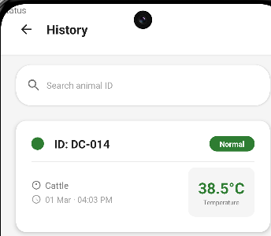

# FLIR ACE Camera Setup Guide

## Target Hardware - FLIR iXX Series
- **FLIR i34** - 240×320 thermal resolution, 5" touchscreen, ACE platform
- **FLIR i35** - 240×320 thermal resolution, 5" touchscreen, ACE platform with LTE
- **FLIR i64** - 480×640 thermal resolution, 5" touchscreen, ACE platform

All iXX series cameras feature:
- 5-inch rugged touchscreen
- Android-based ACE platform
- Physical hardware buttons (D-pad, Select, Back)
- Glove-friendly design
- IP54 rated (dust and water resistant)

## Screen Configuration

### Display Specifications
- **Screen Size**: 5 inches diagonal
- **Typical Resolution**: ~480x800 density-independent pixels
- **Configuration Qualifier**: `values-w480dp-h800dp`

### Optimizations Applied

#### Touch Targets (Glove-Friendly)
```
Minimum: 56dp (vs 48dp standard Android)
Standard Button: 64dp (vs 56dp standard)
Large Button: 80dp (vs 72dp standard)
```

#### Text Sizes (Enhanced Readability)
```
Small: 13sp
Body: 15sp
Subheading: 17sp
Heading: 19sp
Title: 23sp
Large Title: 28sp
Display: 38sp
```

#### Scan Overlay
```
Size: 280dp (optimized for 5" screen)
```

#### Menu Cards
```
Height: 80dp (easy to tap with gloves)
Corner Radius: 16dp
Elevation: 4dp
```

## Hardware Button Support

### Physical Controls
The ACE platform includes hardware buttons for field use:

1. **D-Pad Navigation**
   - Up/Down/Left/Right: Navigate between focusable elements
   - Focus indicator: 4dp green outline

2. **Select Button**
   - Activates the currently focused element
   - Equivalent to tapping on touchscreen

3. **Back Button**
   - Returns to previous screen
   - Handled by Android back stack

4. **On/Off Button**
   - Power management
   - Handled by system

### Focus Order
All screens implement logical focus order:
- Landing: Start button
- Menu: Scan → Analytics → History → Exit
- Scan: Back → Scan → Share (when visible)
- History: Filter → Search → List items

## Testing Checklist

### On ACE Hardware
- [ ] All buttons are easily tappable with gloves
- [ ] Text is readable at arm's length
- [ ] Focus indicator is clearly visible
- [ ] D-pad navigation works smoothly
- [ ] Scan overlay is properly sized
- [ ] Menu cards are easy to select
- [ ] Back button returns to previous screen

### Field Conditions
- [ ] Screen readable in bright sunlight
- [ ] Touch targets work with work gloves
- [ ] Navigation possible without looking at screen
- [ ] Battery life is acceptable
- [ ] Thermal camera integration works

## Configuration Files

### Primary ACE Configuration
```
app/src/main/res/values-w480dp-h800dp/dimens.xml
```

### Fallback Configurations
```
app/src/main/res/values/dimens.xml (default)
app/src/main/res/values-sw600dp/dimens.xml (7-10" tablets)
app/src/main/res/values-sw720dp/dimens.xml (10"+ tablets)
```

## Switching Between Emulator and Real Camera

In `MainActivity.java`, line 88:
```java
// For testing on emulator:
private static final CommunicationInterface aceRealCameraInterface = CommunicationInterface.EMULATOR;

// For testing on real ACE camera:
private static final CommunicationInterface aceRealCameraInterface = CommunicationInterface.ACE;
```

## Deployment Notes

### APK Configuration
The app is configured for:
- **Min SDK**: 33 (Android 13)
- **Target SDK**: 36 (Android 14+)
- **ABI**: arm64-v8a only (ACE platform)
- **Legacy Packaging**: Enabled for compatibility

### Permissions Required
- `CAMERA` - For thermal camera access
- `INTERNET` - For ACE internal communication

### Installation
1. Build APK: `./gradlew assembleRelease`
2. Transfer to ACE camera via USB or network
3. Install: `adb install app-release.apk`
4. Grant camera permission when prompted

## Troubleshooting

### Camera Not Connecting
- Verify `CommunicationInterface.ACE` is set
- Check camera permissions are granted
- Ensure ACE SDK libraries are in `app/libs/`

### UI Elements Too Small
- Verify device is using `values-w480dp-h800dp` configuration
- Check in Android Studio: Tools → Layout Inspector

### Focus Not Working
- Ensure all interactive elements have `android:focusable="true"`
- Check focus order with D-pad navigation
- Verify `focus_highlight.xml` drawable is applied

### Text Not Readable
- Increase text sizes in `values-w480dp-h800dp/dimens.xml`
- Adjust contrast in `values/colors.xml`
- Test in actual field lighting conditions

## Performance Tips

1. **Thermal Rendering**: Use hardware acceleration (OpenGL)
2. **Battery**: Minimize background processing
3. **Storage**: Use SharedPreferences for small data
4. **Network**: Only when needed (for sharing reports)

## Support

For FLIR ACE SDK documentation and support:
- FLIR Developer Portal: https://developer.flir.com/
- ACE Platform Documentation: Check SDK package
- Technical Support: Contact FLIR support team
